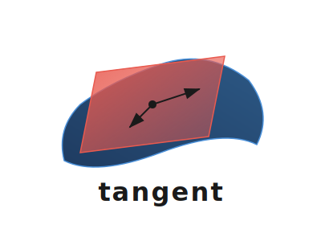

<p align="center">
  <picture>
    <source media="(prefers-color-scheme: dark)" srcset="docs/_static/tangent-logo-dark.svg">
    <source media="(prefers-color-scheme: light)" srcset="docs/_static/tangent-logo-light.svg">
    
  </picture>
</p>

# Tangent

[](https://github.com/k-sheridan/Tangent/actions/workflows/test.yml)
[](https://github.com/k-sheridan/Tangent/actions/workflows/benchmark.yml)
[](https://k-sheridan.github.io/Tangent/)

**Header-only generic optimizer for manifold-based nonlinear least squares**

Originally designed for sliding window estimation in visual SLAM and odometry.

## Features

- SE3/SO3 manifold optimization with Lie algebra.
- Built in marginalization support through Sparese Gaussian Prior.
- Sparse Schur complement solver for exploiting sparsity in uncorrelated variables.
- Cache-friendly SlotMap data structures (O(1) operations)
- Compile-time type safety with template metaprogramming
- Optional parallel algorithms for multi-threaded optimization

## Installation

**Add to your CMake project:**
```cmake
include(FetchContent)
FetchContent_Declare(tangent
  GIT_REPOSITORY https://github.com/k-sheridan/Tangent.git
  GIT_TAG main
)
FetchContent_MakeAvailable(tangent)
target_link_libraries(your_target PRIVATE Tangent::Tangent)
```

## Usage

Refer to [test/TestTangentExampleProblem.cpp](test/TestTangentExampleProblem.cpp) for an example on how to use.

## Testing & Benchmarking

**Docker:**
```bash
docker-compose up test       # Run All Tangent tests
docker-compose up benchmark  # Run performance benchmarks
```

## Requirements

- C++20 compiler (GCC 10+, Clang 12+, MSVC 2019+)
- CMake 3.20+
- Eigen 3.4+ (auto-fetched if not found)
- Sophus 1.22+ (auto-fetched if not found)

## Notes 

Tangent was originally developed as part of the [QDVO (Quasi-Direct Visual Odometry)](https://github.com/k-sheridan/qdvo) project.
